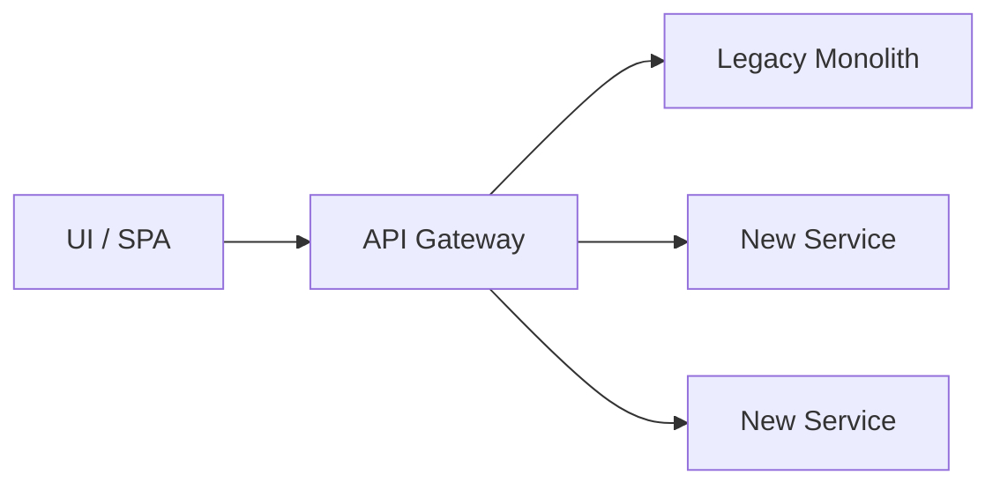

---

layout: post
title: "Modernizing Legacy Platforms Without a Big-Bang Rewrite"
date: 2026-01-26
categories: [Architecture & Modernization]
excerpt: "A pragmatic approach to migrating enterprise monoliths to microservices without disrupting production systems."
---

  

Modernizing a legacy enterprise platform is rarely a technical problem alone — it’s a **risk-management exercise**.  

In regulated domains like Insurance, a big-bang rewrite is usually a **career-limiting move**. The system works, customers depend on it, and downtime is not an option.  

### The Core Principle
> **Change the architecture without stopping the business.**  

### What Actually Works

- Start with a **modular monolith** before jumping to microservices
- Identify **business-capability boundaries**, not technical layers
- Introduce APIs *around* the legacy system, not inside it
- Migrate **one workflow at a time**, not entire modules  

### Architecture Pattern 

  

### Key Lessons

- Databases are harder to split than code
- Identity and authentication must be centralized early
- Observability matters more than perfect design  

### Final Thought
Modernization succeeds when architecture evolves **incrementally**, with business trust intact.