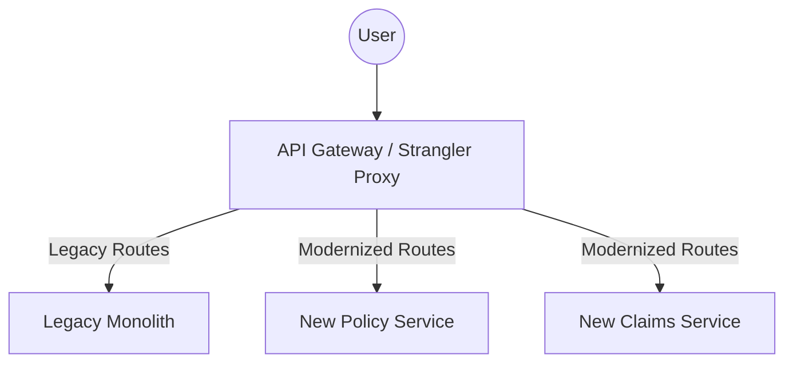
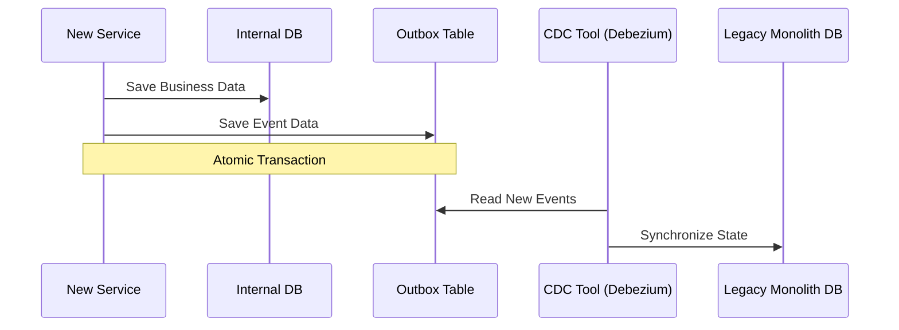

Modernizing a legacy enterprise platform is rarely a technical problem alone — it’s a **risk-management exercise**. In high-stakes, regulated domains like Insurance or FinTech, a "big-bang" rewrite is often a career-limiting move. The system works, customers depend on it, and downtime is simply not an option.

In this deep dive, we’ll explore how to transform a monolithic legacy system into a modern, resilient architecture without stopping the business.

### The Big-Bang Trap
Why do big-bang rewrites fail?
1. **Scope Creep**: Developers want to fix *everything* at once.
2. **Hidden Requirement Loss**: Years of bug fixes and edge-case handling are baked into the legacy code. You won't find them in the old documentation.
3. **Execution Gap**: The business moves forward while you build the replacement. By the time the "new" system is ready, it's already behind.

### The Core Principle: The Strangler Fig Pattern
Inspired by the strangler fig tree that grows around another tree until the original tree dies, this pattern involves building new functionality in new services while gradually intercepting calls to the legacy system.



### Steps to a Successful Migration

#### 1. Identify Business-Capability Boundaries
Don't split by technical layers (UI, Logic, DB). Instead, use **Domain-Driven Design (DDD)** to identify Bounded Contexts. For an insurance platform, this might be *Policy Management*, *Billing*, or *Claims*.

#### 2. Introduce the Proxy Early
Place an API Gateway or a reverse proxy in front of your monolith. This allows you to reroute traffic transparently when a new service is ready.

#### 3. Tackle "Data Gravity"
Databases are the hardest part to split. Use the **Transactional Outbox Pattern** or Change Data Capture (CDC) to keep your new services in sync with the legacy database during the transition.



#### 4. The "Anti-Corruption Layer" (ACL)
Ensure your modern services aren't "polluted" by the legacy system's quirks. Build an ACL to translate between the old data models and the new ones.

```typescript
// example of a simple Anti-Corruption Layer Mapper
export class PolicyMapper {
    static toModernEntity(legacyData: any): ModernPolicy {
        return {
            id: legacyData.P_ID,
            holderName: `${legacyData.F_NAME} ${legacyData.L_NAME}`,
            effectiveDate: new Date(legacyData.EFF_ST_DT),
            // Map legacy status codes to modern enums
            status: this.mapStatus(legacyData.STAT_CD)
        };
    }

    private static mapStatus(code: string): PolicyStatus {
        const mapping = {
            'A': PolicyStatus.Active,
            'C': PolicyStatus.Cancelled,
            'P': PolicyStatus.Pending
        };
        return mapping[code] || PolicyStatus.Unknown;
    }
}
```

### Team Organization: Conway's Law
You cannot build a decoupled architecture with a coupled team. To modernize the system, you must also modernize how you work. Structure your teams around the business capabilities you identified in Step 1.

### Key Lessons Learned the Hard Way
- **Observability is non-negotiable**: Distributed systems are harder to debug. Centralized logging and distributed tracing (OpenTelemetry) must be implemented before the first microservice goes live.
- **Identity must be centralized**: Move authentication out of the monolith and into a dedicated OIDC provider (like OpenIddict or IdentityServer) early in the process.
- **Don't over-engineer**: Not every service needs its own database on day one. Start with logical separation.

### Final Thought
Modernization succeeds when architecture evolves **incrementally**, with business trust intact. Every release should deliver value, not just technical "purity."

---
*Ready to dive deeper? Check out my follow-up post on [Microservices Anti-Patterns](/blogs/microservices-anti-patterns/).*