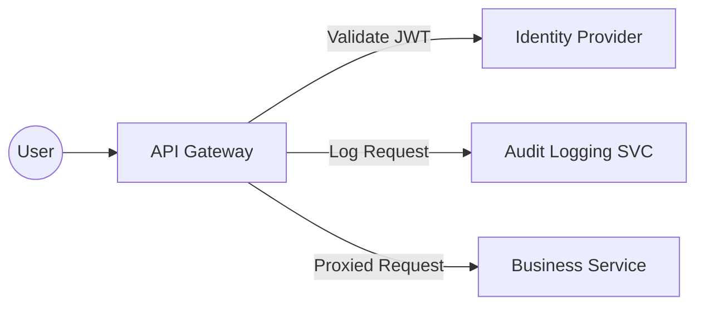
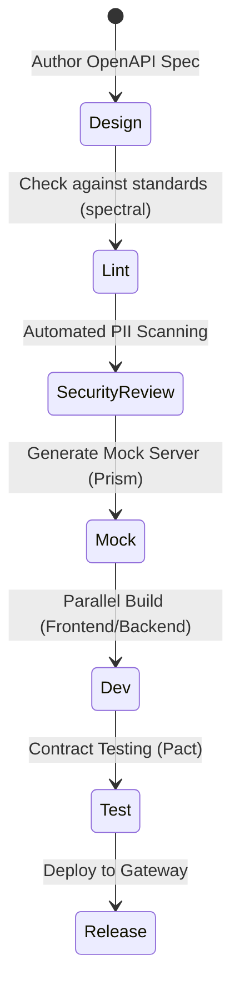

In regulated industries like Insurance and Banking, APIs are not just "technical interfaces"—they are **contractual obligations** and **compliance checkpoints**. An "API-First" approach is the only way to balance the agility of modern development with the rigidity of regulatory requirements.

But what does it actually mean to be API-First in a world of SOC2, HIPAA, or Lloyd's of London standards?

### The API-First Mindset
API-First means the API is a "First-Class Citizen." You design the API contract (OpenAPI/Swagger) **before** you write a single line of backend logic. This allows:
1. **Parallel Development**: Frontend and mobile teams can work against mocks while the backend is built.
2. **Early Governance**: Security and compliance teams can review the contract for data privacy issues (PII) before it's implemented.
3. **Consistency**: Standards are enforced via linting at the design phase.

### Designing for Compliance

#### 1. Data Classification and PII
In regulated domains, you must be explicit about what data is being transmitted. Your OpenAPI spec should include metadata about data sensitivity.

```yaml
# OpenAPI Snippet with custom security labels
components:
  schemas:
    PolicyHolder:
      type: object
      properties:
        fullName:
          type: string
          x-data-classification: "PII"
        dateOfBirth:
          type: string
          format: date
          x-data-classification: "PII-Sensitive"
        policyNumber:
          type: string
          x-data-classification: "Internal"
```

#### 2. Fine-Grained Auditing
Regulatory bodies require an audit trail of *who* accessed *what* and *when*. API-First design incorporates auditing into the middleware layer.



### Versioning Strategies
Breaking a contract in a regulated environment isn't just a bug; it's a client relationship disaster. 

- **Breaking Changes**: Never happen in the same version.
- **Header Versioning**: `Accept: application/vnd.company.v1+json` - elegant, but harder for some clients to implement.
- **URL Versioning**: `/v1/policies` - clear, explicit, and easy to route at the gateway.

### Governance Workflow

A robust API-First workflow for regulated domains looks like this:



### Security: Beyond the Basics
In these industries, OAuth2/OIDC is the baseline. You should also consider:
- **mTLS (Mutual TLS)**: For high-security B2B integrations.
- **JARM (JWT Secured Authorization Response Mode)**: Ensures the response itself is signed/encrypted.
- **Scopes**: Don't just check if a user is "authenticated." Use scopes like `policies:read` or `claims:write` for least-privilege access.

### Implementing a Contract-First approach in .NET
If you are using .NET, tools like `NSwag` or `Swashbuckle` can generate code from your OpenAPI spec, ensuring the implementation never drifts from the contract.

```csharp
// Use [ApiController] and strong typing to enforce the contract
[Route("api/v1/[controller]")]
[ApiController]
[Authorize(Policy = "RequirePolicyReadScope")]
public class PoliciesController : ControllerBase
{
    [HttpGet("{id}")]
    [ProducesResponseType(typeof(PolicyResponse), StatusCodes.Status200OK)]
    [ProducesResponseType(StatusCodes.Status403Forbidden)]
    public async Task<IActionResult> GetPolicy(string id)
    {
        // Implementation logic
    }
}
```

### Conclusion
API-First in regulated domains is about **predictability**. By treating the API as a product and a legal contract, you reduce risk, improve developer experience, and ensure long-term stability in complex ecosystems.

---
*Interested in the security layer? Read my post on [Enterprise OIDC Integration with OpenIddict](/blogs/openiddict-integration/).*