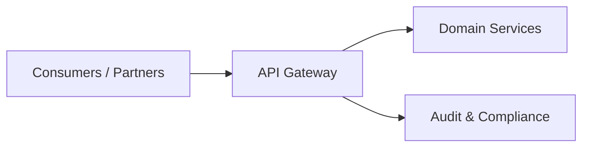

---

layout: post

title: "API-First Architecture in Regulated Domains"

date: 2026-01-26

categories: [Architecture, APIs, Security]

excerpt: "Designing secure, scalable APIs that survive audits, integrations, and long-term evolution."

---

  

API-first architecture is not about REST endpoints — it’s about **organizational clarity**.

  

In regulated systems, APIs become **contracts**, not just interfaces.

### What API-First Really Means

- APIs are designed **before UI and services**

- Contracts are versioned and documented

- Security is built-in, not bolted on

  

### Security Baseline

- OAuth2 + OIDC for identity

- Short-lived tokens

- Explicit scopes per business capability

  

### What Breaks Systems

- Chatty APIs

- Shared authentication logic

- Leaking domain internals

  

### What Scales

- Coarse-grained APIs

- Explicit ownership

- Backward-compatible changes

  

API-first is less about technology — more about **discipline**.