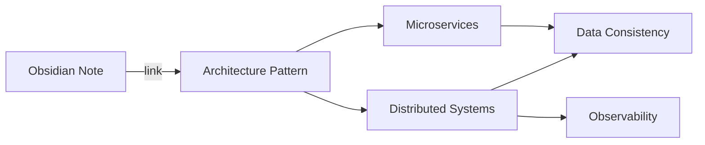

As knowledge workers, we are drowning in information but starving for wisdom. The concept of a **"Second Brain"** — popularized by Tiago Forte — is a system to capture, organize, and retrieve information efficiently. 

While many tools exist (Notion, Roam, Evernote), **Obsidian** stands out for architects and engineers because it treats knowledge like code: it’s local, it’s Markdown, and it’s highly extensible.

### The Architecture of Knowledge
Most people organize notes using folders (a hierarchy). But knowledge is rarely hierarchical; it’s a **graph**. Obsidian allows you to build a personal web of thoughts through bi-directional linking.



### The PARA Method
To prevent "Digital Hoarding," I use a modified version of the PARA method to structure my vault:
1. **Projects**: Active endeavors with a deadline (e.g., "Refactor Auth Service").
2. **Areas**: Ongoing responsibilities (e.g., "Cloud Architecture," "Health").
3. **Resources**: Topics of interest for the future (e.g., "AI Research," "SwiftUI").
4. **Archives**: Completed projects or inactive areas.

### My "Atomic" Workflow: Zettelkasten
The goal of a second brain isn't just to store information, but to generate new ideas. I follow an "Atomic" note-taking approach:
- **Fleeting Notes**: Quick captures on mobile or during a call.
- **Literature Notes**: Summaries of books or articles in my own words.
- **Permanent Notes**: Single, independent ideas. One note = One concept.

### Obsidian for Developers: The Power User Setup
Obsidian's true power lies in its community plugins and its ability to handle technical content.

#### 1. Dataview Plugin (The "SQL" for your notes)
You can query your vault like a database. For example, to list all active projects:

```javascript
// Obsidian Dataview Query
list from "1. Projects"
where status = "Active"
sort priority desc
```

#### 2. Canvas for Visual Thinking
Obsidian Canvas is a spatial layout tool. I use it to map out system architectures or complex logic flows before writing the documentation. It’s like having a whiteboard directly connected to your notes.

#### 3. Mermaid Integration
As you see in this blog, Mermaid is native to Obsidian. You can sketch diagrams using text, keeping your technical notes visual and searchable.

### Syncing and Reliability
Because Obsidian stores files as local `.md` files, I have full control over my data. 
- **Privacy**: No corporate cloud is scraping my thoughts.
- **Longevity**: Even if Obsidian disappears, my notes are just text files.
- **Sync**: I use Git (Obsidian Git plugin) to sync my vault across machines. This gives me version control for my thoughts!

```bash
# My manual sync script for my vault
cd /path/to/my/vault
git add .
git commit -m "🧠 Brain update: $(date)"
git push origin main
```

### Starting Your Second Brain
If you're starting today, don't over-engineer your folder structure. 
1. **Just start writing**.
2. **Link aggressively**. Use `[[Link to Note]]` whenever a concept appears elsewhere.
3. **Review weekly**. Turn links that don't exist yet (red links) into new notes.

### Conclusion
A Second Brain is an investment in your future self. By offloading "storage" to a system like Obsidian, you free up your biological brain for what it does best: **creativity and problem-solving.**

---
*Want to see how I use these tools in my coding workflow? Check out [the Antigravity Workflow](/blogs/antigravity-workflow/).*