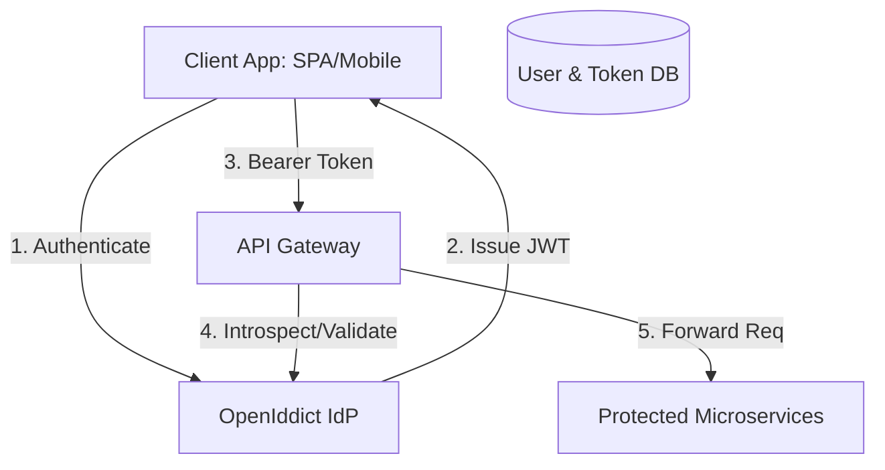
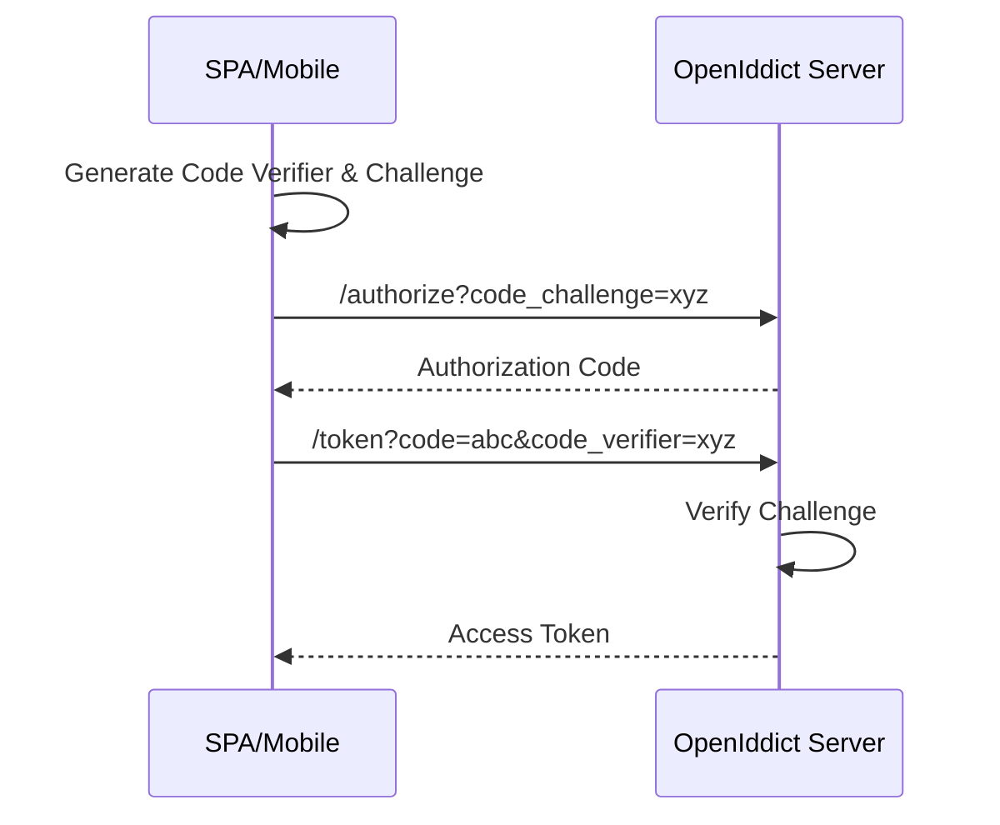

In modern distributed systems, **Identity is the Perimeter**. While many choose managed services like Auth0 or Okta, enterprise requirements often demand a custom Identity Provider (IdP) for full control over data sovereignty, token customization, and integration with legacy user stores.

In the .NET ecosystem, **OpenIddict** has emerged as the most flexible and powerful framework for building standards-compliant OIDC/OAuth2 servers.

### Why OpenIddict?
Unlike traditional frameworks that dictate how your database or UI should work, OpenIddict focus purely on the **protocol logic**. 
- **DB Agnostic**: Supports EF Core, MongoDB, or your custom persistence layer.
- **Low Level**: You own every endpoint (Authorize, Token, UserInfo).
- **Standards Compliant**: Implements OIDC, OAuth2, and advanced specs like Pushed Authorization Requests (PAR).

### The Architecture of an IdP



### Key Implementation Steps

#### 1. Configuring the OpenIddict Core
In your startup configuration, you define which OIDC features you want to enable. For a modern enterprise setup, we typically enable `Authorization Code Flow` with `PKCE`.

```csharp
services.AddOpenIddict()
    .AddCore(options =>
    {
        options.UseEntityFrameworkCore()
               .UseDbContext<ApplicationDbContext>();
    })
    .AddServer(options =>
    {
        // Enable endpoints
        options.SetAuthorizationEndpointUris("/connect/authorize")
               .SetTokenEndpointUris("/connect/token")
               .SetUserinfoEndpointUris("/connect/userinfo");

        // Enable Grant Types
        options.AllowAuthorizationCodeFlow()
               .RequirePcke();

        // Register Signing/Encryption Credentials
        options.AddDevelopmentEncryptionCertificate()
               .AddDevelopmentSigningCertificate();

        // Register ASP.NET Core integration
        options.UseAspNetCore()
               .EnableTokenEndpointPassthrough()
               .EnableAuthorizationEndpointPassthrough();
    });
```

#### 2. Mastering Token Customization
One of the main reasons to use a custom IdP is to inject domain-specific claims into the JWT. This reduces the number of database calls your microservices need to make.

```csharp
[HttpPost("~/connect/token")]
public async Task<IActionResult> Exchange()
{
    var request = HttpContext.GetOpenIddictServerRequest();
    if (request.IsPasswordGrantType())
    {
        var user = await _userManager.FindByNameAsync(request.Username);
        
        // Create the principal
        var principal = await _signInManager.CreateUserPrincipalAsync(user);

        // Add custom claims that will be persisted in the JWT
        principal.SetClaim("organization_id", user.OrganizationId)
                 .SetClaim("tier", user.SubscriptionTier);

        // Define which claims are included in which tokens
        principal.SetDestinations(static claim => claim.Type switch
        {
            "organization_id" => [Destinations.AccessToken, Destinations.IdentityToken],
            _ => [Destinations.AccessToken]
        });

        return SignIn(principal, OpenIddictServerAspNetCoreDefaults.AuthenticationScheme);
    }
}
```

#### 3. Securing the Flow with PKCE
PKCE (Proof Key for Code Exchange) is mandatory for SPAs and mobile apps. It prevents authorization code injection attacks by requiring a cryptographic secret (code_verifier) to be exchanged for the token.



### Lessons from the Trenches
- **Rotation is Key**: Never use development certificates in production. Automate your certificate rotation using Azure Key Vault or AWS Secrets Manager.
- **The "UserInfo" Bottleneck**: Don't put *too much* in the JWT. Use the UserInfo endpoint for non-essential user profile data to keep your tokens small and fast.
- **Introspection for Revocation**: If you need the ability to revoke tokens immediately (e.g., if a user is fired), use **Token Introspection** instead of purely stateless JWT validation.

### Conclusion
Building an IdP with OpenIddict is a serious undertaking, but it provides the ultimate flexibility for complex enterprise architectures. It allows you to transform "Identity" from a hurdle into a strategic asset.

---
*Next up: Learn how we automate development with [the Antigravity Workflow](/blogs/antigravity-workflow/).*