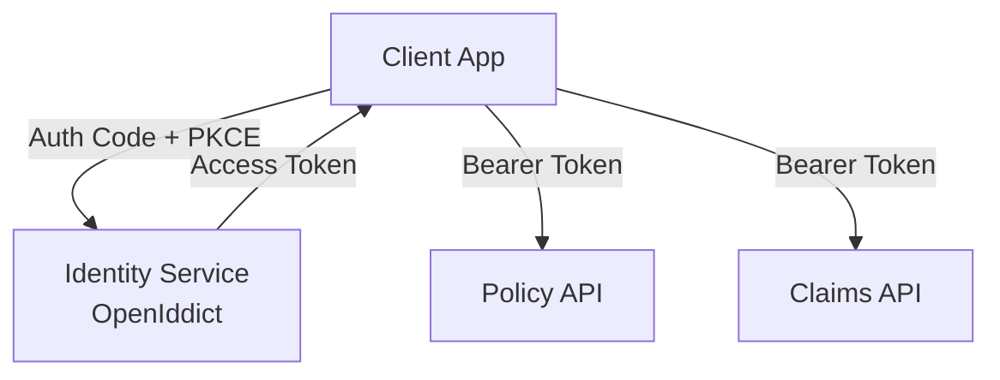

---

layout: post

title: "OpenIddict Integration in Enterprise Microservices"

date: 2026-01-26

categories: [Security, Identity, Microservices]

excerpt: "Using OpenIddict to build secure, extensible identity platforms for enterprise systems."

---

  

Most security failures in microservices happen at the **edges**, not inside services.

  

OpenIddict offers flexibility when IdentityServer is no longer viable or licensed.

  

### Why OpenIddict

- Open-source and extensible

- Deep ASP.NET Core integration

- Suitable for internal identity platforms

  

### Architecture Overview

  

### Best Practices

- Separate identity service

- Centralize token issuance

- Avoid embedding auth logic in services

  

### Hard Truth

Security architecture must be boring, predictable, and auditable.