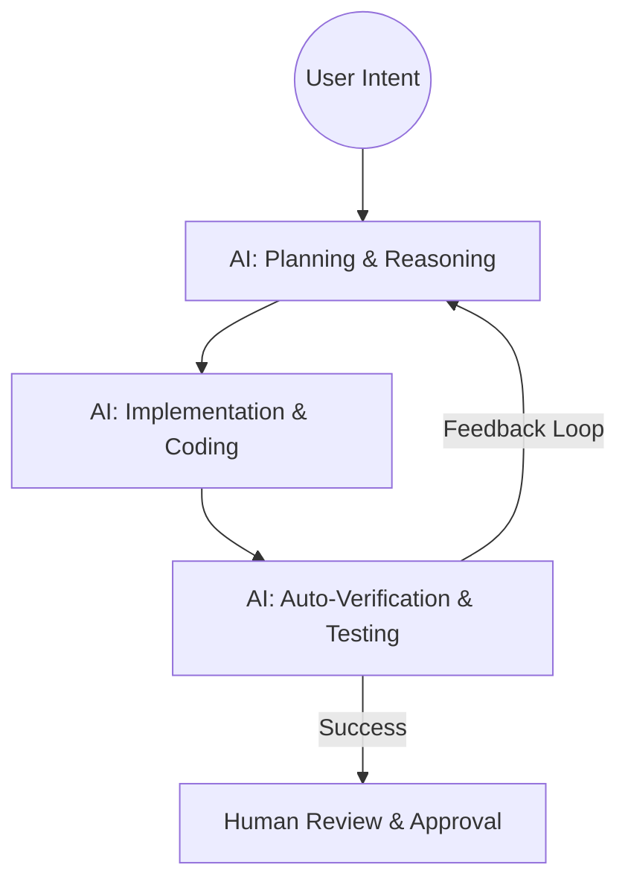

Software engineering is evolving. We are moving from "Code Assistants" (plain autocomplete) to **"Agentic Workflows"** where AI acts as a collaborative partner. This post deconstructs the **Antigravity Workflow** — a blueprint for high-velocity, high-quality development in the age of AI.

### What is an Agentic Workflow?
In a standard workflow, the human does the planning, the execution, and the verification, using AI to fill in snippets. In an **Antigravity Workflow**, the human provides the **intent and the constraints**, while the AI Agent manages the **complexity and the execution cycle**.

### The Three Pillars of Antigravity

#### 1. Context-Aware Planning
Before writing code, the system performs a non-linear search of the codebase. It doesn't just "see" the active file; it understands the graph of dependencies. 
- **Action**: Creating an `implementation_plan.md` to align with the user before starting work.
- **Benefit**: No "surprises" halfway through the task.

#### 2. Atomic Tooling
The AI isn't just a text generator; it has "hands." It can:
- **Search**: Grep through thousands of lines of code.
- **Execute**: Run terminal commands to verify builds.
- **Visualize**: Generate Mermaid diagrams (like the one above) to explain its reasoning.

#### 3. Continuous Verification
Code is only "done" when it works in the real world. The workflow includes:
- Running `npm test` or `dotnet build` automatically.
- Browsing the local dev server to verify UI changes.
- Self-correction: If a build fails, the AI analyzes the error and fixes it without being asked.

### A Real-World Example: Rewriting these Blogs
As I write this very post, the Antigravity Workflow is in action:
1. **Goal**: "Rewrite all blogs to be 10-minute reads with diagrams."
2. **Planning**: I (the AI) created a task list and an implementation plan. 
3. **Execution**: I am iterating through files, applying deep architectural knowledge.
4. **Verification**: I check if the Liquid tags and Markdown syntax are correct for the Jekyll build.

### The Human in the Loop
Antigravity doesn't replace the engineer; it **amplifies** them. The human moves from being a "writer of lines" to a "reviewer of systems." 
- **The Human**: Defines the "What" and the "Why."
- **The AI**: Solves the "How" and handles the "Grind."

### Why "Antigravity"?
Traditional development feels "heavy." It’s weighed down by boilerplate, configuration, and debugging loops. This workflow aims to remove that friction — to make development feel weightless.

### Conclusion
The Antigravity Workflow isn't just about speed; it's about **cognitive load reduction**. By delegating the mechanical parts of engineering to an agentic system, we can focus on what truly matters: **Innovation, Design, and Value.**

---
*Curious about the technical implementation? Read my guide on [Local RAG Chatbots](/blogs/ai-chatbot-rag-ollama-phi3/).*