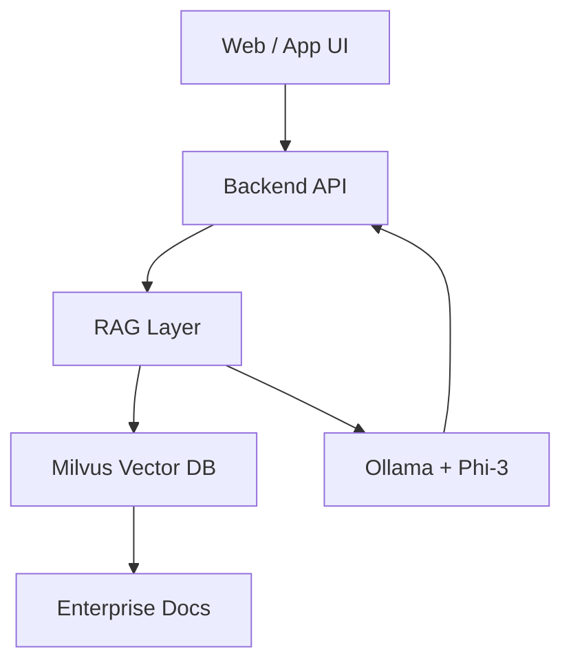

---

layout: post

title: "Building an Enterprise AI Chatbot Using RAG + Ollama + Phi-3"

date: 2026-01-26

categories: [Applied AI & Intelligent Systems]

excerpt: "Moving beyond demos to practical AI assistants using local models and RAG pipelines."

---

  

Enterprise AI is not about ChatGPT wrappers.

It’s about **context, control, and trust**.

  

### Architecture

  

### Why Local Models

- Data privacy

- Predictable cost

- Deployment control

  

### Real Use Cases

- Claims assistance

- Policy queries

- Operational support

  

### Final Take

AI succeeds when it augments humans — not replaces them.