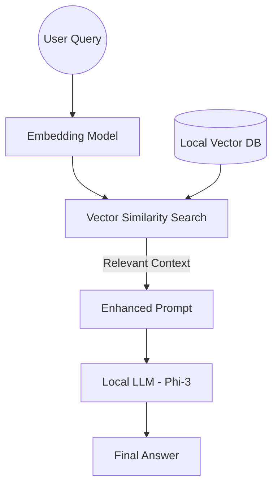

The biggest barrier to enterprise AI adoption is **Data Privacy**. Sending sensitive company documents to a public cloud LLM is often a non-starter. This is where **Local RAG (Retrieval-Augmented Generation)** comes in.

In this guide, we’ll build a fully local RAG pipeline using **Ollama**, Microsoft’s **Phi-3** (a tiny but mighty model), and a local vector database.

### The RAG Architecture
RAG works by "stuffing" relevant context into the model's prompt before it generates an answer. This allows the model to "know" about your private data without being re-trained.



### The Stack
1. **Ollama**: The engine that runs LLMs locally.
2. **Phi-3 Mini**: A 3.8B parameter model that outperforms models twice its size.
3. **ChromaDB or FAISS**: Local storage for your vector embeddings.
4. **LangChain or LlamaIndex**: The orchestration layer.

### Step-by-Step Implementation

#### 1. Setting up Ollama
First, ensure Ollama is running and pull the Phi-3 model:
```bash
ollama serve
ollama pull phi3
```

#### 2. Generating Embeddings
To search your documents, you need to turn them into numbers (vectors). We use a local embedding model (like `mxbai-embed-large`) so that the data never leaves your RAM.

```python
import ollama

def get_embedding(text):
    response = ollama.embeddings(model="mxbai-embed-large", prompt=text)
    return response["embedding"]
```

#### 3. The Retrieval Loop
When a user asks a question, we find the most relevant chunks in our vector database and pass them to Phi-3.

```python
# Simplified RAG Loop
context = vector_db.query(query_embedding, n_results=3)

prompt = f"""
Use the following context to answer the question.
Context: {context}
Question: {user_query}
Answer:
"""

response = ollama.generate(model="phi3", prompt=prompt)
print(response["response"])
```

### Performance Optimization
Running AI locally requires managing hardware resources.
- **Quantization**: By default, Ollama uses `q4_K_M` quantization, which reduces memory usage by 70% with minimal loss in accuracy.
- **GPU Acceleration**: If you have an NVIDIA GPU (CUDA) or Apple Silicon (Metal), Ollama will automatically offload the heavy lifting to the GPU.

### Real-World Use Cases
- **Codebase Assistant**: Index your entire Git repo and ask "Where is the auth logic located?"
- **Private Wiki**: A chatbot that knows all your internal documentation and Slack history.
- **Legal/Medical Analysis**: Processing sensitive records without cloud exposure.

### Why Phi-3?
Microsoft’s Phi-3 is revolutionary because it was trained on "textbook-quality" data. It’s small enough to run on a standard laptop (even a 16GB Mac or a mid-range PC) while being smart enough to handle complex reasoning.

### Conclusion
Building local RAG pipelines is no longer a futuristic dream. With toolsets like Ollama and Phi-3, any developer can build a private, intelligent system in a single afternoon.

---
*Love microservices? See how this fits into a larger system in my [Microservices Anti-Patterns](/blogs/microservices-anti-patterns/) post.*