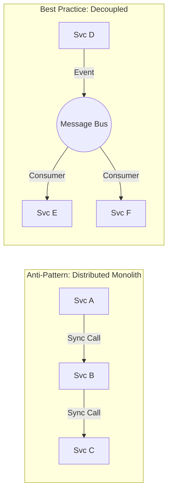
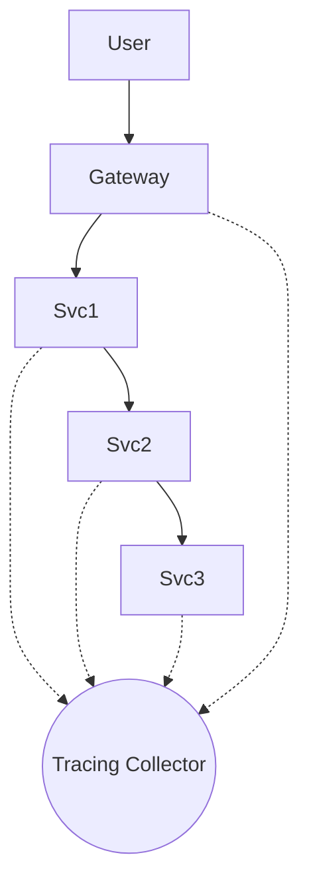

Microservices are like fire: handled correctly, they power your engine; handled poorly, they burn your house down. Most "microservices failures" aren't failures of the technology, but of the **architecture and boundaries**.

In this guide, we’ll catalog the most common microservices anti-patterns and how to steer clear of them.

### 1. The Distributed Monolith
This is the "King of Anti-Patterns." You have separate services, but they are so tightly coupled that you cannot deploy one without deploying them all.

- **Symptoms**: One service’s change breaks three others; long deployment "trains"; synchronous calls everywhere.
- **The Fix**: Use **Asynchronous Messaging** (RabbitMQ, Kafka) and adhere to **Bounded Contexts**. If two services *always* change together, they should probably be one service.

### 2. Nano-services
The opposite of a monolith, where your services are *too small*. One "service" might just be a single CRUD function.

- **Symptoms**: High network latency; impossible to manage 100+ repos for a 5-person team; extreme operational overhead.
- **The Fix**: Aim for **Business Capabilities**, not functions. A service should represent a meaningful domain area (e.g., "Payments," not "ProcessCreditCard").

### 3. Shared Database
Two or more services reading and writing to the same physical database schema.

- **Symptoms**: Fear of changing a table because you don't know who else uses it; performance bottlenecks; constant schema locking.
- **The Fix**: **Database Per Service**. Each service owns its data. If Service A needs Service B’s data, it should request it via an API or subscribe to an event.

### 4. Over-Engineering (The "Netflix" Syndrome)
Implementing complex service meshes, circuit breakers, and global scale on Day 1 for a system that has 10 users.

- **Symptoms**: Developers spending more time on infrastructure than business features.
- **The Fix**: Follow **YAGNI** (You Ain't Gonna Need It). Start with a simple "Modular Monolith" and only split when you have a clear reason (scaling, team size, independent deployment).

### 5. Ignoring Observability
Thinking you can debug a distributed system using console logs.

- **Symptoms**: "It works on my machine" but fails in production; not knowing where a request failed; high MTTR (Mean Time to Resolution).
- **The Fix**: Implement **Distributed Tracing** (OpenTelemetry) and Centralized Logging from the start.

### 6. The "God" Service
One microservice that does 80% of the work while the others are just tiny helpers. This "God Service" becomes the new bottleneck.

- **The Fix**: Re-evaluate your domain boundaries. Use **Event Storming** to identify where the logic actually belongs.

### Summary Table: Anti-Pattern vs. Solution

| Anti-Pattern | Solution |
| :--- | :--- |
| Tightly Coupled Services | Event-Driven Architecture |
| Shared DB | Private Data Ownership |
| Distributed Monolith | Bounded Contexts (DDD) |
| Manual Deployments | CI/CD Automation |
| Siloed Teams | Cross-Functional "Two-Pizza" Teams |

### Closing Thought
Microservices are about **autonomy**. If your architecture doesn't allow teams to move independently, it's not a microservices architecture — it's just a more expensive monolith.

---
*Ready to build something the right way? Revisit my post on [Incremental Modernization](/blogs/legacy-to-microservices/).*
