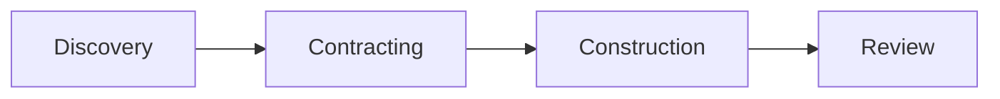
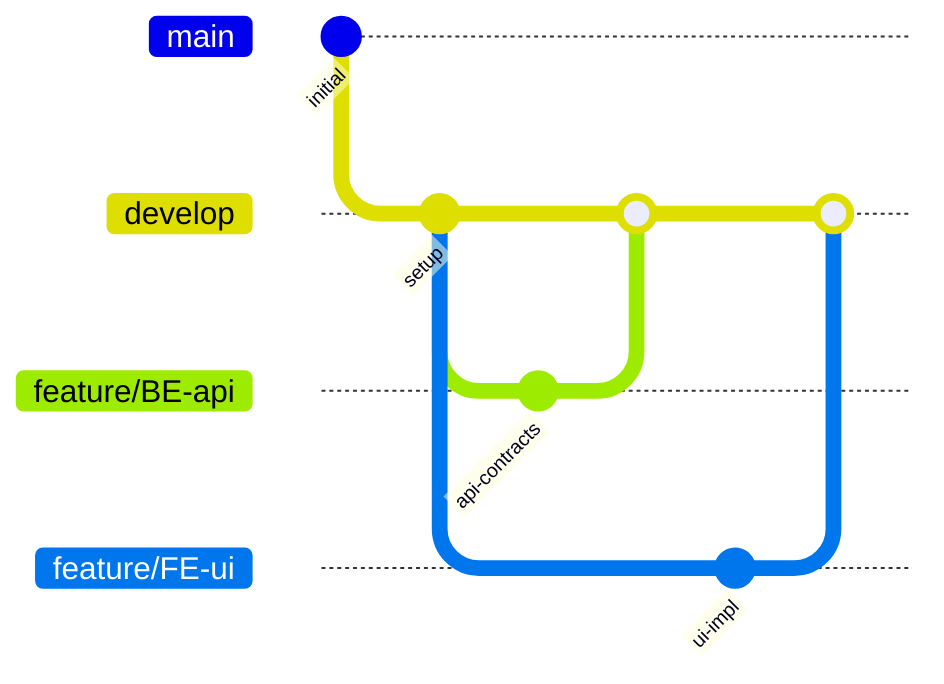

*How a simple "list skills" command evolved into a complete autonomous development workflow*

---

## The Beginning: A Simple Question

It started with a straightforward request:

```
list skills
```

I had a collection of AI agent skills scattered across directories—`pro-programmer`, `pro-solution-architect`, `pro-ui-ux-engineer`, and more. But they were in the wrong location for my AI assistant (Antigravity) to discover them.

**Problem identified**: Skills were in `.agents/skills/` instead of `.gemini/skills/`.

One directory move later, and 10 skills were properly registered. But this raised a bigger question:

> *How do I make these agents work together as a team?*

---

## The Vision: An Autonomous Agent Team

My goal crystallized:

> Build a technology-agnostic agent team with proper agentic workflow. The team should be autonomous when required permissions and kickoff documents are provided.

I didn't want to micromanage each agent. I wanted to:

1. Provide a project kickoff document
2. Grant necessary permissions
3. Let the team execute through structured phases
4. Review and approve at key checkpoints

---

## Phase 1: Skill Analysis

First, we analyzed all 10 existing skills:

| Skill                            | Role                  |
| -------------------------------- | --------------------- |
| `pro-project-lead`               | Team orchestrator     |
| `pro-solution-architect`         | System design, ADRs   |
| `pro-ui-ux-engineer`             | User flows, design    |
| `pro-back-end-engineer`          | APIs, databases       |
| `pro-front-end-engineer`         | UI components         |
| `pro-programmer`                 | Core implementation   |
| `pro-ai-engineer`                | RAG, MCP, prompts     |
| `pro-code-reviewer`              | Code quality          |
| `pro-front-end-testing-engineer` | Testing               |
| `skill-creator`                  | Meta: creating skills |

### What We Found

**Strengths:**
- Each skill had "Team Interconnects" defining dependencies
- Clear phase references embedded in skills
- File ownership patterns (`/docs/ADR/`, `/docs/HLD/`)

**Gaps:**
- Referenced documents didn't exist (`orchestration.md`, `TEAM_STATUS.md`)
- No kickoff template
- Inconsistent description formats
- `pro-ui-ux-engineer` was missing Team Interconnects entirely

---

## Phase 2: Designing the Workflow

A 4-phase workflow emerged naturally from the skill interconnects:

```
Phase 1: Discovery → Understand requirements, create blueprints
Phase 2: Contracting → Define API contracts between FE/BE
Phase 3: Construction → Implement the solution
Phase 4: Review → Verify quality, test, close
```



### Key Design Decisions

1. **Sequential Phase Gating**: No phase proceeds without the previous completing
2. **Single Conductor**: `pro-project-lead` authorizes all transitions
3. **Partial Team Profiles**: Not every project needs all agents
    - API-only: Skip UI/UX, FE, FE Testing
    - Frontend-only: Skip BE, AI
    - Full-stack: All agents

---

## Phase 3: Building the Framework

### Skills Refinement

We standardized all 9 skill descriptions with:
- Phase triggers ("Triggers in Phase 1")
- Ownership ("Owner of /docs/ADR/")
- Technology-agnostic language

**Before:**
```yaml
description: Specialized in core web technologies (JS/HTML/CSS)...
```

**After:**
```yaml
description: Framework-agnostic front-end expertise. Use for component
architecture, state management, web performance. Triggers in Phase 2
(Contracting) and Phase 3 (Construction).
```

### Rules Creation

Created `.gemini/rules/` with:
1. **orchestration.md** - Phase definitions, skill activation, handoff format
2. **git-workflow.md** - Multi-agent branching, commit conventions, conflict resolution

### Templates Created

| Template                    | Purpose                      |
| --------------------------- | ---------------------------- |
| `kickoff-template.md`       | Project intake form          |
| `workflow.md`               | Detailed phase documentation |
| `TEAM_STATUS-template.md`   | Feature-level tracking       |
| `PR_TRACKER-template.md`    | Pull request management      |
| `definition-of-done.md`     | Per-phase checklists         |
| `design-system-template.md` | UI tokens, components        |
| `USER_RESPONSIBILITIES.md`  | Owner's guide                |

---

## Phase 4: Git Workflow for Multiple Agents

A critical question arose:

> How do multiple agents work on their own branches without conflicts?

### The Solution



**Key Rules:**
1. Each skill works on its own branch
2. Dependency order enforced (Architect → BE → FE)
3. Conflicts escalate to `pro-project-lead`
4. Merge queue with dependencies tracked in `PR_TRACKER.md`

---

## The Final Framework: ProTeam

After several iterations, we named it **ProTeam Framework**:

```
ProTeam/
├── .gemini/
│   ├── rules/
│   │   ├── orchestration.md
│   │   └── git-workflow.md
│   └── skills/
│       └── (10 specialized agents)
├── docs/
│   └── (11 templates)
└── README.md
```

### How It Works

1. **Create kickoff document** with project details and permissions
2. **Start the team**: "Initialize as pro-project-lead using docs/kickoff.md"
3. **Agents self-organize** through phases
4. **You approve** at checkpoints (ADRs, contracts, PRs, DoD)
5. **Project completes** with full documentation

---

## Lessons Learned

### 1. Start with Existing Patterns
The skills already had team interconnects—we just formalized them.

### 2. Progressive Disclosure Works
Keep skill bodies lean; put details in `references/` files.

### 3. Not Everything Needs Full Process
Simple tasks can bypass the framework entirely:
- Direct: "Fix the bug in auth.ts"
- Single skill: "As pro-code-reviewer, review this function"

### 4. Human-in-the-Loop is Essential
Autonomous ≠ unsupervised. Key checkpoints ensure quality and alignment.

---

## What's Next?

The framework is now [live on GitHub](https://github.com/shameed/ProTeam-Framework). Future enhancements could include:
- Technology-specific reference patterns (React, .NET, Python)
- Integration with CI/CD pipelines
- Metrics and reporting dashboards
- More partial-team profiles

---

## Try It Yourself

1. Clone the repository
2. Copy `docs/kickoff-template.md` → `docs/kickoff.md`
3. Fill in your project details
4. Start with: "Initialize as pro-project-lead using docs/kickoff.md"

Let your AI team do the heavy lifting while you focus on the decisions that matter.

---

*Built in a single session, from "list skills" to GitHub push. That's the power of structured AI collaboration.*
