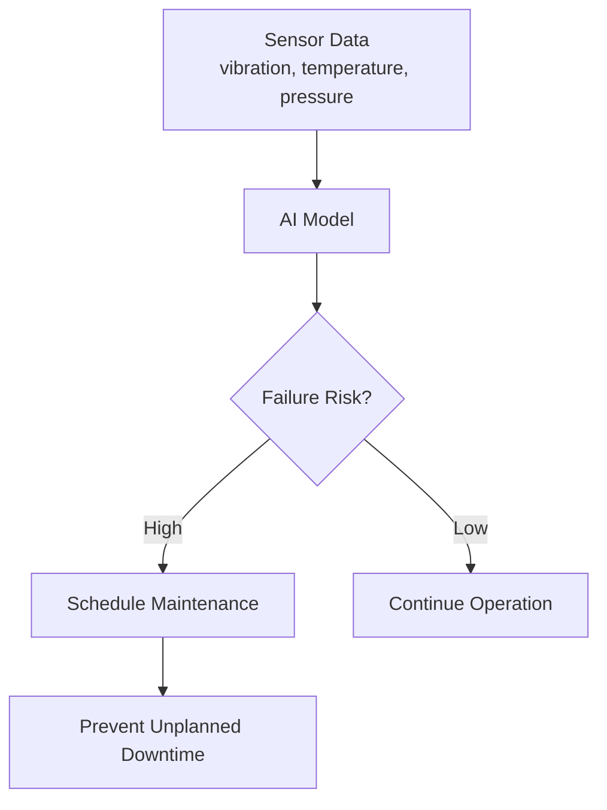

*From diagnostic imaging to fraud detection, AI models tailored to specific industries are delivering measurable results. Here's how.*

---

## The Shift from General to Specialized

General-purpose AI models like GPT and BERT revolutionized what's possible with machine learning. But industries with specialized terminology, regulatory requirements, and domain-specific data patterns have discovered something important:

> **Industry-specific models outperform generalists when the domain is well-defined.**

Why? Because healthcare language isn't retail language. Financial fraud patterns don't look like manufacturing defects. And the cost of a wrong prediction varies dramatically across sectors.

Let's explore how four major industries are putting specialized AI to work.

---

## Healthcare: From Diagnosis to Drug Discovery

Healthcare AI isn't a future promise—it's already in production. Here are the key use cases:

### 1. Diagnostic Imaging Analysis

AI models trained on millions of medical images now match or exceed radiologist performance for specific conditions:

| Use Case                | Example                                                                 |
| ----------------------- | ----------------------------------------------------------------------- |
| Cancer detection        | Analyzing mammograms for breast cancer biomarkers                      |
| Retinal disease         | Detecting diabetic retinopathy from fundus photographs                 |
| Pneumonia identification| Analyzing chest X-rays for COVID-19 and bacterial pneumonia            |
| Cardiac assessment      | Identifying heart attack indicators from ECG patterns                  |

**Real-World Example**: Google Health's DeepMind developed an AI system that can detect over 50 eye diseases from retinal scans with accuracy comparable to expert ophthalmologists.

### 2. Drug Discovery Acceleration

Traditional drug development takes 10-15 years and costs billions. AI is compressing this timeline:


AI models can:
- Predict how new molecules interact with human proteins
- Simulate side effects before human trials
- Identify promising candidates from millions of compounds

**Real-World Example**: Insilico Medicine used AI to design a novel drug candidate for fibrosis in just 18 months—a process that typically takes 4-5 years.

### 3. Remote Patient Monitoring

Wearables combined with AI create continuous health surveillance:

- **Arrhythmia detection** from smartwatch data
- **Fall prediction** for elderly patients
- **Mental health indicators** from voice pattern analysis

---

## Finance: Security, Speed, and Personalization

Financial services have embraced AI for three core reasons: protecting assets, processing speed, and customer experience.

### 1. Fraud Detection at Scale

Every credit card transaction runs through ML models that have learned what "normal" looks like for each customer:

```
Transaction Pattern Analysis:
├── Location anomaly (purchase in country you've never visited)
├── Amount anomaly (unusually large purchase)
├── Velocity anomaly (many purchases in short timeframe)
├── Merchant category mismatch
└── Device fingerprint changes
```

**Real-World Example**: PayPal's AI systems analyze millions of transactions in real-time, reducing fraud losses while minimizing false positives that frustrate legitimate customers.

### 2. Credit Scoring 2.0

Traditional credit scores use limited data points. AI-powered alternatives analyze:

- Transaction history patterns
- Banking behavior (how often you check balances)
- Bill payment consistency
- Employment stability indicators

**Impact**: More accurate risk assessment means better rates for creditworthy borrowers and reduced defaults for lenders.

### 3. Algorithmic Trading

Hedge funds and investment banks deploy AI for:

| Application              | What It Does                                              |
| ------------------------ | --------------------------------------------------------- |
| Pattern recognition      | Identifies market trends invisible to human traders       |
| Sentiment analysis       | Processes news and social media in milliseconds           |
| Portfolio optimization   | Balances risk/reward across thousands of instruments      |
| Execution optimization   | Splits large orders to minimize market impact             |

**Real-World Example**: BlackRock's Aladdin platform manages over $21 trillion in assets, using AI for risk analysis, portfolio management, and trading decisions.

---

## Manufacturing: Prediction, Quality, and Optimization

Manufacturing has one of the clearest ROI stories for AI: prevent downtime, reduce defects, optimize throughput.

### 1. Predictive Maintenance

The value proposition is simple: replace parts *before* they fail, not after.



AI models detect early warning signs humans miss:
- Subtle vibration changes in bearings
- Temperature drift patterns
- Acoustic signatures of wear

**Real-World Example**: BMW uses AI predictive maintenance on assembly lines, reducing unplanned downtime by up to 25% and extending equipment lifespan.

### 2. Automated Quality Control

Computer vision has transformed quality inspection:

- **Speed**: AI inspects 100% of products vs. human sampling
- **Consistency**: No fatigue, no subjective variation
- **Precision**: Detects defects invisible to naked eye

**Applications**:
- Surface defect detection on metal parts
- Weld quality assessment
- Component alignment verification
- Color consistency checks

**Real-World Example**: Tesla's Gigafactories use AI-powered cameras to inspect battery cells, identifying microscopic defects that could cause failures.

### 3. Supply Chain Optimization

AI helps manufacturers answer critical questions:

- How much inventory should we hold at each location?
- Which supplier is most likely to delay?
- What's the optimal production schedule given current constraints?

**Real-World Example**: Walmart uses AI to predict demand fluctuations and optimize inventory across 10,000+ stores, reducing waste while maintaining availability.

---

## Retail: Personalization at Scale

Retail AI might be the most visible to consumers—it powers the "you might also like" recommendations you see every day.

### 1. Hyper-Personalized Recommendations

Modern recommendation engines go far beyond "customers who bought X also bought Y":

```
Personalization Signals:
├── Browse history and dwell time
├── Search queries
├── Purchase history
├── Cart abandonment patterns
├── Device and time-of-day context
├── External factors (weather, events, trends)
└── Predicted life events (moving, new baby, etc.)
```

**Real-World Example**: Netflix estimates its recommendation engine saves $1 billion annually in reduced customer churn by keeping users engaged with relevant content.

### 2. Dynamic Pricing

AI-powered pricing adjusts in real-time based on:

- Competitor pricing
- Inventory levels
- Demand signals
- Time-of-day patterns
- Customer willingness-to-pay

**Real-World Example**: Amazon changes prices millions of times per day, optimizing revenue while remaining competitive.

### 3. Visual Search and Try-On

AI bridges the physical-digital gap:

- **Visual search**: Take a photo of a product, find it online
- **Virtual try-on**: See how clothes or makeup look on you
- **Size prediction**: Reduce returns with accurate fit recommendations

**Real-World Example**: Sephora's Virtual Artist app uses AR and AI to let customers try on makeup virtually, increasing conversion rates for featured products.

---

## Building Industry-Specific Models: Key Considerations

If you're developing or deploying specialized AI, here are the critical factors:

### 1. Domain Expertise is Non-Negotiable

```
Generic ML Engineer + Generic Data → Generic Results
Domain Expert + Labeled Data + ML Engineer → Specialized Model
```

You need people who understand:
- Industry terminology and edge cases
- Regulatory requirements (HIPAA, PCI-DSS, etc.)
- What "correct" actually means in this context

### 2. Data Quality Trumps Quantity

| Approach                  | Outcome                                   |
| ------------------------- | ----------------------------------------- |
| 1M noisy samples          | Mediocre model that fails on edge cases   |
| 100K clean, labeled samples| Production-ready model with known limits  |

### 3. Explainability Matters

In regulated industries, "the model said so" isn't acceptable:

- Healthcare: Clinicians need to understand *why* a diagnosis is suggested
- Finance: Regulators require audit trails for credit decisions
- Manufacturing: Engineers need to validate maintenance recommendations

### 4. Continuous Learning is Essential

Industry patterns evolve:
- Fraud tactics change
- New diseases emerge
- Market conditions shift
- Customer preferences evolve

Your model deployment pipeline needs mechanisms for:
- Performance monitoring
- Drift detection
- Retraining triggers
- A/B testing new versions

---

## Getting Started with Industry AI

Whether you're exploring AI for your industry or evaluating vendor solutions, here's a practical framework:

### Step 1: Identify High-Value Use Cases

Focus on problems where:
- Human decisions are expensive or slow
- Patterns exist but are complex
- The cost of errors is quantifiable
- Data is available (even if not perfect)

### Step 2: Start with Proven Patterns

Don't reinvent from scratch. Look for:
- Pre-trained industry models (medical imaging, financial NLP)
- Transfer learning opportunities
- Vendor solutions with your industry focus

### Step 3: Build Feedback Loops

The first model is just the starting point:


### Step 4: Measure Business Impact

Track metrics that matter to the business:
- Healthcare: Diagnostic accuracy, time-to-diagnosis
- Finance: Fraud prevented, false positive rate
- Manufacturing: Downtime reduced, defects caught
- Retail: Conversion lift, return rate reduction

---

## Final Thoughts

Industry-specific AI models aren't a nice-to-have—they're becoming table stakes for competitive organizations. The examples above aren't research projects; they're production systems generating real value today.

The key insight? **Specialization beats generalization when the domain is well-understood and the stakes are high.**

Start with a clear use case, invest in domain expertise, and build the feedback loops that turn a first model into a learning system that improves over time.

---

*What industry-specific AI applications are you exploring? Share your experiences in the comments.*
