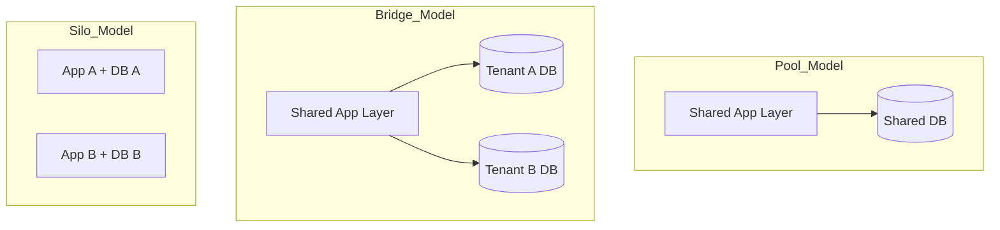
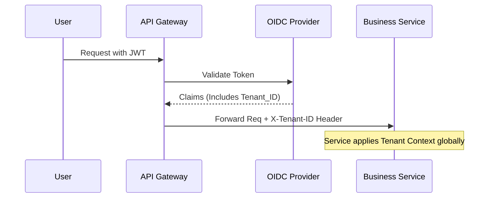

Building a Software-as-a-Service (SaaS) platform is easy; building a **multi-tenant** SaaS platform that scales, remains secure, and stays cost-effective is one of the most significant challenges a Solution Architect will face.

In this deep dive, we’ll move beyond the basics of "sharing a database" and look at the structural decisions that define the long-term success of a SaaS venture.

---

### 1. Understanding the Multi-Tenant Mindset
Multi-tenancy is not just about sharing resources; it's about **Tenant Isolation**. A "tenant" is a group of users (usually a company) that shares a common access policy and set of data. As an architect, your primary goal is to ensure that Tenant A can never see, modify, or even impact the performance of Tenant B.

---

### 2. The Three Pillars of SaaS Architecture
We generally categorize SaaS architectures into three models. The choice between them impacts your COGS (Cost of Goods Sold), complexity, and security posture.

#### A. The Silo Model (Full Isolation)
Each tenant gets their own dedicated infrastructure (stack).
- **Pros**: Maximum isolation, no "noisy neighbor" issues, easy to meet strict compliance (HIPAA, etc.).
- **Cons**: High cost, nightmare to manage updates across 100s of stacks.

#### B. The Pool Model (Full Sharing)
Tenants share everything: app servers, databases, and caches.
- **Pros**: Maximum cost efficiency, centralized management.
- **Cons**: High risk of cross-tenant data leakage if not handled carefully, hard to manage performance.

#### C. The Bridge Model (Hybrid)
Common application layer, but isolated databases or schemas.



---

### 3. Data Partitioning Strategies
Your data strategy is the most critical decision. If you get this wrong, migration later is almost impossible.

#### Option 1: Database-per-Tenant
Every tenant has their own connection string.
- **Use Case**: High-value enterprise customers who demand physical data separation.
- **Architect's Tip**: Use a "Catalog Database" to map Tenant IDs to Connection Strings.

#### Option 2: Schema-per-Tenant (PostgreSQL Search Path)
One database, but each tenant has a dedicated schema.
- **Pros**: Easier to manage than 500 databases, but provides some level of logical isolation.

#### Option 3: Shared Schema (Discriminator Column)
Every table has a `TenantId` column.
- **Implementation**: In .NET/EF Core, use **Global Query Filters** to ensure the `TenantId` is always appended to every `WHERE` clause automatically.

```csharp
// Example using EF Core Global Query Filters
protected override void OnModelCreating(ModelBuilder modelBuilder)
{
    modelBuilder.Entity<Order>()
        .HasQueryFilter(o => o.TenantId == _currentTenantService.GetTenantId());
}
```

---

### 4. The Identity Bridge
Identity in SaaS is complex. You need to distinguish between **Authentication** (Who are you?) and **Tenant Context** (Which company do you belong to?).

A request flow in a modern multi-tenant system:


---

### 5. Tackling the "Noisy Neighbor"
In a Pool model, a single tenant running a massive report can degrade the experience for everyone else. 
**Solution**: Implementation of **Tiered Throttling**.
- **Free Tier**: 10 req/sec.
- **Enterprise Tier**: 500 req/sec.
- **Architecture**: Use a Redis-backed rate limiter at the API Gateway level that keys off the `TenantID`.

---

### 6. Tenant Onboarding: The Hidden Complexity
Onboarding should be a "zero-touch" operation. When a customer signs up:
1. **Provision Identity**: Create a tenant entry in the OIDC provider.
2. **Setup Data**: Run migrations for the new schema or database (if using Silo/Bridge).
3. **Seed Data**: Populate default roles, templates, and settings.
4. **Notify**: Trigger internal systems (Salesforce, Stripe).

---

### 7. Performance & Metrics
Standard CPU/RAM metrics are useless in SaaS. You need **Tenant-Aware Metrics**:
- Which tenant is consuming 80% of the database I/O?
- What is the cost-to-serve for Tenant A?
- Are specific tenants experiencing higher latency than others?

Use OpenTelemetry with `tenant.id` as a resource attribute on every span and metric.

---

### 8. Conclusion: Choosing Your Path
If you are building a B2C app or a small B2B tool, start with the **Pool Model** (Shared Schema) for velocity. If you are targeting Enterprise clients in Finance or Healthcare, the **Bridge Model** or **Silo Model** is non-negotiable for security compliance.

The hallmark of a great SaaS architect is not how well they share resources, but how effectively they isolate them.

---
*Building for the enterprise? Don't miss my piece on [API-First Architecture in Regulated Domains](/blogs/api-first-regulated/).*
